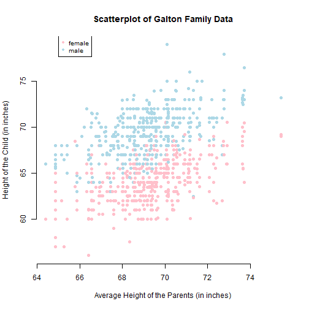

Course Project: Shiny Application and Reproducible Pitch
========================================================
author: "Harshad B."
date: "14/09/2020"

First Slide
========================================================

## About the Course Project

This is a deliverable for the course Developing Data Products as part of the Coursera Data Science Specialization.

Instructions:

1. Write a shiny application with associated supporting documentation. The documentation should be thought of as whatever a user will need to get started using your application.
2. Deploy the application on Rstudio's shiny server
3. Share the application link by pasting it into the provided text box
4. Share your server.R and ui.R code on github

Second Slide
========================================================

## How to use the application

Using the data provided by Galton Families dataset, we fit a linear model to predict a child's height based on the gender and parent's average height.

The application is running on 
(http://rpubs.com/harshad12patre/sarpcp)

ui.R, and Server.R Code in my github repository
(https://github.com/harshad12patre/datasciencecoursera/tree/master/SARP)

Slide With Code
========================================================

The data used in the app comes from the GaltonFamilies dataset. 


```r
library(HistData)
data(GaltonFamilies)
summary(GaltonFamilies)
```

```
     family        father         mother      midparentHeight    children     
 185    : 15   Min.   :62.0   Min.   :58.00   Min.   :64.40   Min.   : 1.000  
 066    : 11   1st Qu.:68.0   1st Qu.:63.00   1st Qu.:68.14   1st Qu.: 4.000  
 120    : 11   Median :69.0   Median :64.00   Median :69.25   Median : 6.000  
 130    : 11   Mean   :69.2   Mean   :64.09   Mean   :69.21   Mean   : 6.171  
 166    : 11   3rd Qu.:71.0   3rd Qu.:65.88   3rd Qu.:70.14   3rd Qu.: 8.000  
 097    : 10   Max.   :78.5   Max.   :70.50   Max.   :75.43   Max.   :15.000  
 (Other):865                                                                  
    childNum         gender     childHeight   
 Min.   : 1.000   female:453   Min.   :56.00  
 1st Qu.: 2.000   male  :481   1st Qu.:64.00  
 Median : 3.000                Median :66.50  
 Mean   : 3.586                Mean   :66.75  
 3rd Qu.: 5.000                3rd Qu.:69.70  
 Max.   :15.000                Max.   :79.00  
                                              
```

Slide With Plot
========================================================

In the scatterplot below are represented the data used for the prediction model.


